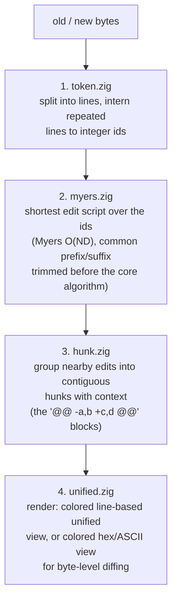

# zdiff

A `diff`-like tool and library written in Zig, built around the [Myers diff
algorithm](http://www.xmailserver.org/diff2.pdf) (the same algorithm behind
GNU `diff` and Git).

## How it works

The diff is computed in four stages, each in its own module under `src/`:



`src/root.zig` wires these into the public `diff()` entry point and also
exposes `applyScript()`, which replays an edit script against `old`/`new` to
reconstruct `new` — used in tests and benchmarks to check round-trip
correctness.

`src/main.zig` is the CLI: it reads two files and calls `diff()`.

## Install

Requires Zig **0.16.0** (see `build.zig.zon`).

Clone and build:

```sh
git clone <repo-url> zdiff
cd zdiff
zig build
```

The binary is produced at `zig-out/bin/zdiff`.

### As a library dependency

```sh
zig fetch --save git+https://github.com/akiidjk/zdiff
```

then in your `build.zig`:

```zig
const zdiff_dep = b.dependency("zdiff", .{ .target = target, .optimize = optimize });
exe.root_module.addImport("zdiff", zdiff_dep.module("zdiff"));
```

## CLI usage

```sh
zig build run -- <old-file> <new-file>
# or, after zig build:
./zig-out/bin/zdiff <old-file> <new-file>
```

This tokenizes both files by line, diffs them, and prints a colored unified
diff (`@@ -a,b +c,d @@` hunk headers, `-`/`+`/space-prefixed lines).

## Library usage

```zig
const zdiff = @import("zdiff");

// line-based diff, prints colored unified output to stdout
try zdiff.diff(allocator, old_bytes, new_bytes, false);

// raw byte diff, prints colored hex/ASCII dump instead
try zdiff.diff(allocator, old_bytes, new_bytes, true);
```

The `zdiff` module also re-exports the `token`, `hunk`, and `unified`
submodules (their types and rendering helpers), for code that consumes a
`diff()`-produced view rather than calling into the algorithm itself. The
Myers edit-script builder (`myers.myers` / `myers.shortestEdit`) is currently
internal to the package and not re-exported by `root.zig`, so `diff()` is the
supported entry point for computing a diff from library code today.

`zdiff.applyScript(comptime T, alloc, script, old, new)` replays a
`myers.Edit` script to reconstruct `new` from `old`; it's used internally
(tests, benchmarks) to check that an edit script round-trips correctly, and
takes the same `[]const myers.Edit` type the (currently internal) diff
algorithm produces.

`diff()` caps the edit distance it will search at 6500 before giving up with
`error.TooDifferent` — fine for typical file-sized diffs, but worth knowing
if you point it at two files that share almost nothing.

## Testing

```sh
zig build test
```

Runs unit tests in `src/root.zig`/`src/main.zig` plus the dedicated suite in
`src/tests.zig` (Myers core, prefix/suffix trimming, hunk grouping, apply
round-trips).

## Benchmarking

```sh
zig build bench
```

`src/bench.zig` times each pipeline stage (tokenize, diff, apply, hunk) over
synthetic random inputs and, if present, a real-world corpus at
`corpus/index.txt` (tab-separated `old\tnew` file pairs).

Generate a corpus from any local git repo's history:

```sh
scripts/generator.sh /path/to/some/repo corpus 300
```

Compare the release CLI with GNU `diff` using `hyperfine`:

```sh
scripts/benchmark.sh
```

This covers large files with few changes, completely different files within
`zdiff`'s edit-distance limit, scattered edits, long common prefixes and
suffixes, and 200 small-file invocations. Output rendering goes to
`/dev/null`; each case is exported as JSON under `benchmark-results/`.

Set `BENCH_SIZE_MB` (10 to 100), `BENCH_RUNS`, `BENCH_WARMUP`, or
`BENCH_RESULTS` to override the defaults.

Create the Python environment and plot the latest run:

```sh
uv sync
uv run python scripts/plot_benchmarks.py
```

Pass a result directory or `--output FILE` to select another run or output
path. Each case gets its own scale and shows mean runtime with standard
deviation. The second column shows the peak memory reported by `hyperfine`.
GNU memory runs in a separate `hyperfine` process because version 1.20 retains
the first command's peak for later commands. Lower is better.

## License

MIT — see [LICENSE](LICENSE).
