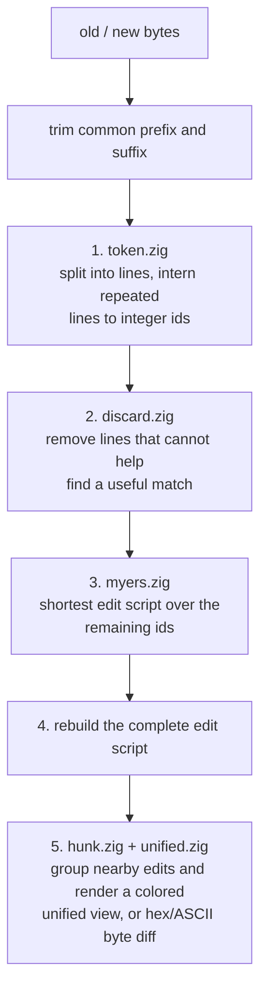

# zdiff

A small `diff`-like tool and library for Zig. It uses the [Myers diff
algorithm](http://www.xmailserver.org/diff2.pdf), the same algorithm behind
GNU `diff` and Git.

## How it works

For text files, `zdiff` first skips the matching start and end. The remaining
work moves through five small stages in `src/`:


```mermaid
flowchart TD
    A["old / new bytes"] --> B["trim common prefix and suffix"] --> C
    C["1. token.zig<br/>split into lines, intern repeated<br/>lines to integer ids"] --> D
    D["2. discard.zig<br/>remove lines that cannot help<br/>find a useful match"] --> E
    E["3. myers.zig<br/>shortest edit script over the<br/>remaining ids"] --> F
    F["4. rebuild the complete edit script"] --> G
    G["5. hunk.zig + unified.zig<br/>group nearby edits and render a colored<br/>unified view, or hex/ASCII byte diff"]
```

`src/root.zig` ties this together behind `diff()`. It also exposes
`applyScript()`, which replays an edit script to rebuild `new`. The tests and
benchmarks use it as a round-trip check.

`src/main.zig` is the command-line wrapper. It reads two files and calls
`diff()`.

## Install

Requires Zig **0.16.0** (see `build.zig.zon`).

Clone and build:

```sh
git clone <repo-url> zdiff
cd zdiff
zig build
```

The binary is produced at `zig-out/bin/zdiff`.

### As a library dependency

```sh
zig fetch --save git+https://github.com/akiidjk/zdiff
```

then in your `build.zig`:

```zig
const zdiff_dep = b.dependency("zdiff", .{ .target = target, .optimize = optimize });
exe.root_module.addImport("zdiff", zdiff_dep.module("zdiff"));
```

## CLI usage

```sh
zig build run -- <old-file> <new-file>
# or, after zig build:
./zig-out/bin/zdiff <old-file> <new-file>

# byte-by-byte hex/ASCII diff
./zig-out/bin/zdiff --binary <old-file> <new-file>
```

By default, it splits both files into lines and prints a colored unified diff.
That means `@@ -a,b +c,d @@` headers and lines beginning with `-`, `+`, or a
space. Empty and single-line ranges follow the usual unified-diff rules. A
file without a final newline gets the familiar `\\ No newline at end of file`
marker.

The exit status is `0` when files match, `1` when they differ, and `2` for an
error such as an unreadable file or a diff that is too large to calculate.

## Library usage

```zig
const zdiff = @import("zdiff");

// Line diff, written to stdout as colored unified output.
_ = try zdiff.diff(io, allocator, old_bytes, new_bytes, false);

// Byte diff, written as a colored hex and ASCII dump.
_ = try zdiff.diff(io, allocator, old_bytes, new_bytes, true);
```

The module re-exports `token`, `hunk`, and `unified` for callers that need the
types or renderers behind a `diff()` result. `diff()` returns the same `0` and
`1` statuses as the CLI. The Myers edit-script builder stays private, so use
`diff()` to calculate a diff from library code.

`zdiff.applyScript(comptime T, alloc, script, old, new)` replays a
`myers.Edit` script to rebuild `new` from `old`. It is mainly useful for tests
and benchmarks, and takes the `[]const myers.Edit` produced by the internal
diff engine.

`diff()` returns `error.TooDifferent` once the edit distance crosses a
GNU-diff-style limit based on input size. The lower bound is 4096.

## Testing

```sh
zig build test
```

Runs unit tests in `src/root.zig`/`src/main.zig` plus the dedicated suite in
`src/tests.zig` (Myers core, prefix/suffix trimming, hunk grouping, apply
round-trips).

## Benchmarking

```sh
zig build bench
```

`src/bench.zig` times tokenizing, diffing, applying, and hunk building on
random data. If `corpus/index.txt` exists, it also uses those tab-separated
`old\tnew` file pairs.

Generate a corpus from any local git repo's history:

```sh
scripts/generator.sh /path/to/some/repo corpus 300
```

Compare the release CLI with GNU `diff` and `diff --minimal` using `hyperfine`:

```sh
scripts/benchmark.sh
```

The suite covers large files with small changes, scattered edits, long shared
prefixes and suffixes, completely different files within the limit, and 200
small-file runs. It sends rendering to `/dev/null` and saves JSON under
`benchmark-results/`.

Set `BENCH_SIZE_MB` (10 to 100), `BENCH_RUNS`, `BENCH_WARMUP`, or
`BENCH_RESULTS` to override the defaults.

Create the Python environment and plot the latest run:

```sh
uv sync
uv run python scripts/plot_benchmarks.py
```

Pass a result directory or `--output FILE` to choose another run or image
path. Each case gets its own scale with mean runtime and standard deviation.
The second column shows peak memory from `hyperfine`. GNU variants run in
separate `hyperfine` processes because version 1.20 reuses the first command's
peak for later commands. Lower values win.

## License

MIT. See [LICENSE](LICENSE).
